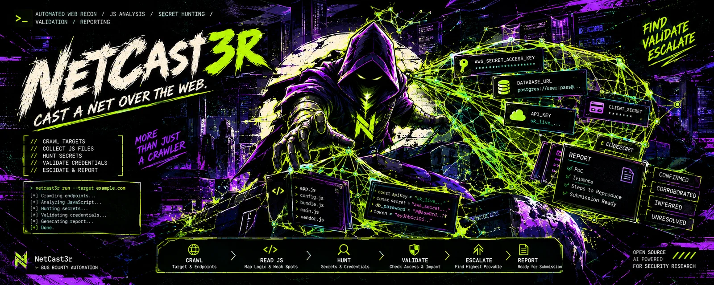
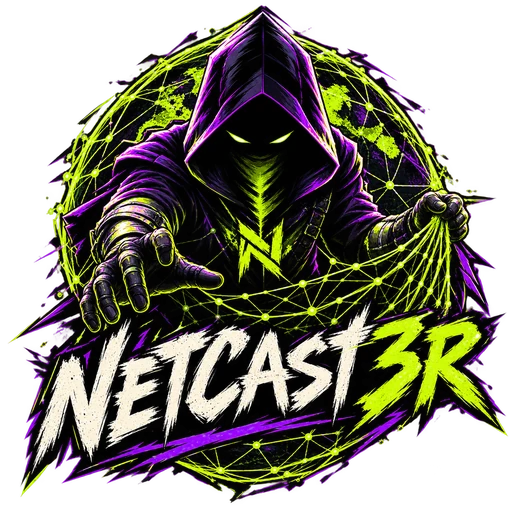
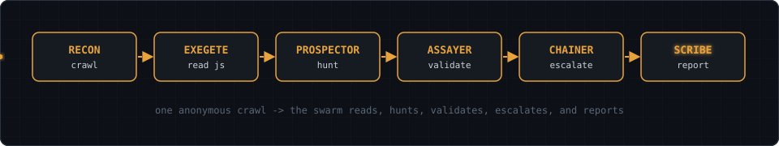

# NetCast3r

Cast a net over the web. NetCast3r crawls a target, reads its JavaScript,
hunts for secrets and logic holes, validates every credential it finds, and
writes a report you can submit.

The pipeline, the agent swarm, the validation engine, the evidence store, the
report writer, the live console, the lab, and the test suite are all in place.

<p align="center">
  
</p>

<p align="center">
  
</p>

<p align="center">
  
</p>

## What it does

- Crawls a target and every endpoint it can reach, then collects the JavaScript
- Reads the JavaScript line by line to map the logic and surface weak spots
- Hunts for secrets, keys, tokens, and hardcoded credentials
- Validates each credential against its provider and reports what it can access
- Escalates to the highest provable impact when write access is enabled
- Writes a submission-ready report with proof and reproduction steps

## Scope files

Both scope files take one entry per line. Blank lines and lines starting with
`#` are ignored. The out-of-scope file wins over the in-scope file.

```
example.com            the host and all of its subdomains
*.example.com          subdomains only
https://example.com/p  scheme and path prefix
10.0.0.0/24            an IPv4 network
re:^api\.              a regular expression against the host
```

## Install

```
pipx install git+https://github.com/DeathShotXD/NetCast3r.git
netcast3r --version
```

## Usage

```
netcast3r recon --input target.com --scope scope.txt --out-of-scope oos.txt
netcast3r run   --input target.com --scope scope.txt --out-of-scope oos.txt --html
```

## Dashboard

`--html` writes a self-contained dashboard next to the report. It carries its
own artwork and styles, so the single file opens in any browser, attaches to an
email, or sits in a repository without a build step.

```
netcast3r dashboard --results results            open the run you just finished
netcast3r dashboard --demo --out dashboard.html  write the sample run and exit
```

The dashboard shows the six stage rail, the counters, the coverage split, the
validation ladder, the severity donut, the caught credentials, the findings
table, and the agent log, all driven by the events of one run. The console uses
the same palette and the same state names, so a run reads the same in the
terminal and in the browser. See [docs/DESIGN.md](docs/DESIGN.md).

## How it works

<p align="center">
  
</p>

The crawler collects JavaScript inside scope, then pulls historical bundles
from the Wayback Machine. The exegete reads each file and maps its logic. The
prospector hunts credentials across 231 patterns. The classifier names any
candidate the patterns did not recognise, rates its confidence, and remembers
the answer for later runs. The assayer validates every candidate against its
provider with read-only recipes. The chainer maps the escalation, the sentinel
scores and de-duplicates, and the report is written with the values redacted.
If no provider answers, the deterministic path still produces a report.

## Detection

The pattern catalog is built from the gitleaks rule set and the validation
recipes follow the keyhacks endpoints. Every candidate is scored for
confidence using its pattern, its entropy, its length, and the surrounding
code. Unknown values are handed to the classifier agent, which names the
service and can re-type the candidate so the right recipe runs. A route that
omits the model still works: detection and validation never depend on a model.

See [docs/architecture.md](docs/architecture.md).

<p align="center">
  
</p>

## Lab

The lab proves the pipeline with no provider key and nothing real:

```
bash lab/run_lab.sh
netcast3r run --input http://127.0.0.1:8099/ --out results \
  --patterns lab/patterns.toml --recipes lab/recipes.toml
```

See [lab/README.md](lab/README.md).

## Providers

NetCast3r talks to any OpenAI-compatible endpoint. OpenCode Zen and OpenRouter
are configured first by default; Ollama and custom endpoints are supported.

## Responsible use

NetCast3r is built for authorized testing only. Run it against systems you own
or have explicit written permission to assess.

## License

MIT. See [LICENSE](LICENSE).
