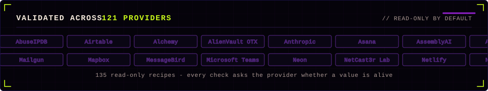
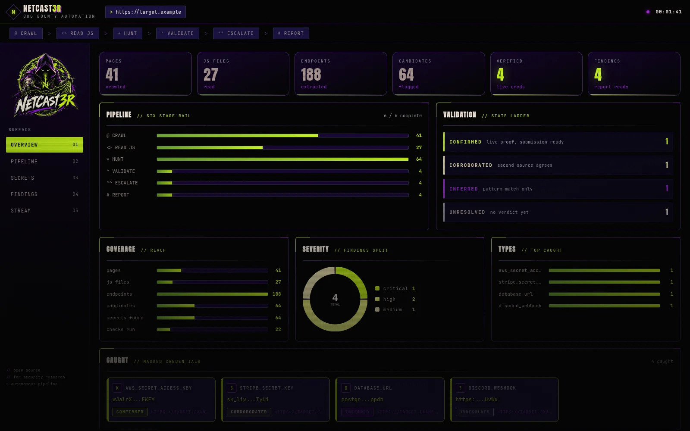

# NetCast3r

<p align="center">
  
</p>

Cast a net over the web. NetCast3r crawls a target, reads the JavaScript it
serves, hunts 310 secret patterns, and checks every candidate against its
provider with 135 read-only recipes. It returns a four-state verdict, the
evidence behind it, and a report you can submit as-is.

<p align="center">
  
</p>

<p align="center">
  
  
  
  
  
  
</p>

<p align="center">
  <b><a href="#install">Install</a></b> | <b><a href="#usage">Usage</a></b> | <b><a href="#outputs">Outputs</a></b> | <b><a href="#docs">Docs</a></b> | <b><a href="SECURITY.md">Security</a></b> | <b><a href="CONTRIBUTING.md">Contributing</a></b>
</p>

<p align="center">
  
</p>

Detection is only the first step. A pattern match says that something looks
like a key; NetCast3r asks the provider whether it is alive, records what that
key can reach, and escalates when write access is enabled. Every finding
leaves the pipeline with evidence, reproduction steps, and the value already
redacted, so the report can go straight into a program.

<details>
<summary>Contents</summary>

- [What it does](#what-it-does)
- [How it works](#how-it-works)
- [What it finds](#what-it-finds)
- [Coverage](#coverage)
- [Example run](#example-run)
- [Outputs](#outputs)
- [Dashboard](#dashboard)
- [Install](#install)
- [Usage](#usage)
- [Scope files](#scope-files)
- [Lab](#lab)
- [Model providers](#model-providers)
- [Docs](#docs)
- [Responsible use](#responsible-use)
- [License](#license)

</details>

## What it does

<p align="center">
  
</p>

- **Crawl** a target and every endpoint it can reach, then collect the JavaScript
- **Read** each bundle line by line to map the logic and surface weak spots
- **Hunt** for secrets, keys, tokens, and hardcoded credentials
- **Validate** each credential against its provider and report what it can access
- **Escalate** to the highest provable impact when write access is enabled
- **Report** with proof, redacted values, and reproduction steps

## How it works

<p align="center">
  
</p>

The crawler maps the target's subdomains from certificate transparency and
DNS first, then walks each host and collects the JavaScript inside scope, and
finally pulls historical bundles from the Wayback Machine. The exegete reads
each file and maps its logic. The
prospector hunts credentials across 310 patterns. The classifier names any
candidate the patterns did not recognise, rates its confidence, and remembers
the answer for later runs. The assayer validates every candidate against its
provider with read-only recipes. The chainer maps the escalation, the sentinel
scores and de-duplicates, and the report is written with the values redacted.
If no provider answers, the deterministic path still produces a report.

See [docs/architecture.md](docs/architecture.md).

## What it finds

<p align="center">
  
</p>

Every candidate leaves the pipeline with one of four states: **CONFIRMED**
carries live proof and is ready to submit, **CORROBORATED** means a second
source agrees, **INFERRED** is a pattern match with no live check behind it,
and **UNRESOLVED** has no verdict yet. Values are masked before the report is
written.

The pattern catalog is built from the gitleaks rule set and the validation
recipes follow the keyhacks endpoints. Every candidate is scored for
confidence using its pattern, its entropy, its length, and the surrounding
code. Unknown values are handed to the classifier agent, which names the
service and can re-type the candidate so the right recipe runs. A route that
omits the model still works: detection and validation never depend on a model.

See [docs/architecture.md](docs/architecture.md).

## Coverage

<p align="center">
  
</p>

310 patterns cover cloud, storage, payments, messaging, CI, and model
credentials, and each candidate can be put to 135 read-only recipes across 121
providers. Every check is read-only by default, `--tier write` opts in to the
ones that change state. A report is written either way, with no provider key
required.

## Example run

<p align="center">
  
</p>

Recon collects, the exegete reads, the prospector ranks, the assayer puts each
candidate to its provider, and scribe writes the report and the dashboard.
With `--dashboard` the same run is mirrored live into the browser.

## Outputs

| File | What it is |
| --- | --- |
| `report.md` | the submission-ready report: impact, proof, reproduction, remediation |
| `results.json` | summary and findings, for scripts |
| `results.jsonl` | one finding per line, for streaming into other tools |
| `results.sarif` | SARIF 2.1.0, upload it to GitHub code scanning |
| `dashboard.html` | the self-contained dashboard, plus `dashboard.json` beside it |

## Dashboard

<p align="center">
  
</p>

`--html` writes a self-contained dashboard next to the report. The file
carries its own artwork and styles, so it opens in any browser, attaches to
an email, or sits in a repository without a build step.

```bash
netcast3r dashboard --results results            open the run you just finished
netcast3r dashboard --demo --out dashboard.html  write the sample run and exit
```

The console uses the same palette and the same state names, so a run reads
the same in the terminal and in the browser. See [docs/DESIGN.md](docs/DESIGN.md).

<p align="center">
  
</p>

## Install

Python 3.10 or newer.

```bash
pipx install git+https://github.com/DeathShotXD/NetCast3r.git
netcast3r --version
```

## Usage

```bash
netcast3r recon --input target.com --scope scope.txt --out-of-scope oos.txt
netcast3r run   --input target.com --scope scope.txt --out-of-scope oos.txt --html
netcast3r run   --input target.com --scope scope.txt --json --jsonl --sarif
netcast3r providers
```

`--depth`, `--rate`, `--delay`, `--timeout`, and `--retries` tune the crawl.
Subdomain mapping runs by default for a domain target; pass `--no-subdomains`
to stay on the host you named.
`--tier` selects the action tier, `--resume` reuses earlier validations, and
`--fail` exits non-zero when findings exist.

### Exit codes

| Code | Meaning |
| --- | --- |
| `0` | the command finished |
| `1` | no input given, no command given, or `--fail` found something |
| `2` | the arguments could not be parsed |

## Scope files

Both scope files take one entry per line. Blank lines and lines starting with
`#` are ignored. The out-of-scope file wins over the in-scope file.

```
example.com            the host and all of its subdomains
*.example.com          subdomains only
https://example.com/p  scheme and path prefix
10.0.0.0/24            an IPv4 network
re:^api\.              a regular expression against the host
```

## Lab

The lab proves the pipeline with no provider key and nothing real:

```bash
bash lab/run_lab.sh
netcast3r run --input http://127.0.0.1:8099/ --out results \
  --patterns lab/patterns.toml --recipes lab/recipes.toml
```

See [lab/README.md](lab/README.md).

## Model providers

NetCast3r talks to any OpenAI-compatible endpoint. OpenCode Zen and OpenRouter
are configured first by default; Ollama and custom endpoints are supported.
Run `netcast3r providers` to see what is configured. The classifier is
optional: detection and validation work without it.

<p align="center">
  
</p>

## Docs

- [Architecture](docs/architecture.md) - stages, scope, tiers, and the fallback path
- [Design](docs/DESIGN.md) - palette, type, and the validation ladder
- [Contributing](CONTRIBUTING.md) - the ground rules for a pull request
- [Security policy](SECURITY.md) - how to report a problem in NetCast3r
- [Changelog](CHANGELOG.md) - what changed in each version

## Responsible use

NetCast3r is built for authorized testing only. Run it against systems you own
or have explicit written permission to assess.

## License

MIT. See [LICENSE](LICENSE).
